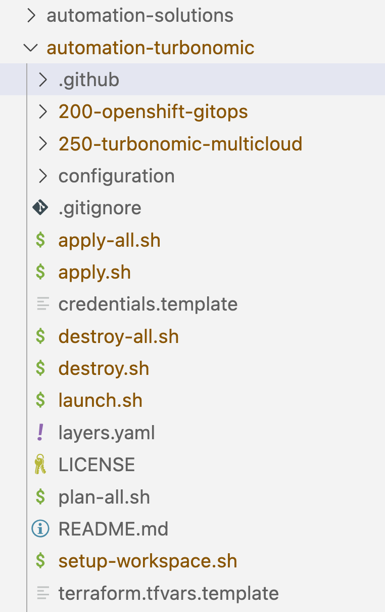
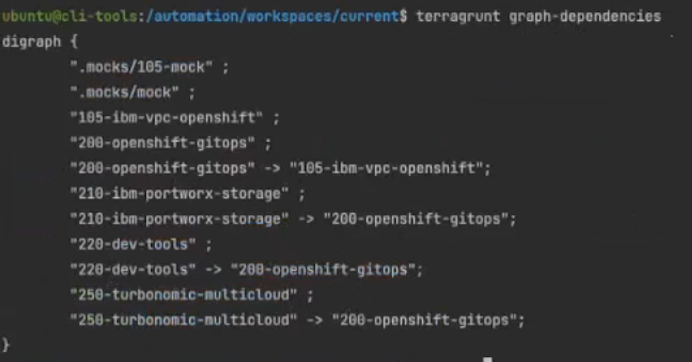

# End To End Testing for any Software Module

The following provides step-by-step instructions for the end-to-end testing of software BOMs (e.g. Turbonomic) which can be replicated for any software such as CP4I, CP4D etc.

- Turbonomic Repo - https://github.com/IBM/automation-turbonomic

## Follow the steps to implement the end-to-end testing

1. Checkout the Git repo from the https://github.com/cloud-native-toolkit/automation-solutions

    ```shell
    git clone https://github.com/cloud-native-toolkit/automation-solutions.git
    ```

2. Clone the Git repo for the software (such as turbonomic) which needs to be tested end-to-end

    ```shell
    git clone https://github.com/IBM/automation-turbonomic.git
    ```

    !!! note 
    
        - Make sure the you keep the automation solutions and automation-turbonomic in the same level directory since we will be generating the files that will go directly to automation-turbonomic folder. 
        - Otherwise, you need to copy the files and manually move to automation-turbonomic folder.

    

3. From the command-line, change dirctory to the the `automation-solutions` repository. Navigate to the folder containing the layers that will be generated. For Turbonomic the path is `boms/software/turbonomic`.

4. Run the generate script to create the automation output. 

    ```shell
    ./generate.sh
    ```

    The output will look something like the following: 
    
    ```shell
    Loading catalog from url: https://modules.cloudnativetoolkit.dev/index.yaml
    Name: 200-openshift-gitops
    Writing output to: ../../../../automation-turbonomic
    Loading catalog from url: https://modules.cloudnativetoolkit.dev/index.yaml
    Name: 250-turbonomic-multicloud
    Writing output to: ../../../../automation-turbonomic
    Copying Files
    Copying Configuration
    ```

    !!! note
    
        Every software layer which requires common layer such as gitops or storage as well as configuration will have a symbolic link to the file(s) in the shared location.

4. Navigate to the software (automation-turbonomic) and verify the files are generated as well as .github folder exist which is requires for the end-to-end test to run.

    

5. Add the end to end test logic in the verify-workflow.yaml (automation-turbonomic\.github\workflows) of the Software module to be tested

    - Below example strategy with do the end-to-end testing for the Turbonomic software on IBM Cloud infrastructure with the storage ODF and Portworx.

    ```yaml
      strategy:
        matrix:
          flavor:
            - ibm
          storage:
            - odf
            - portworx
    ```

7. Add environment variables needed for this module in the verify-pr.yaml

    ```yaml
      env:
        HOME: ""
        IBMCLOUD_API_KEY: ""
    ```

8. The `steps` section represents a sequence of tasks that will be executed as part of job. Add the steps which needs to be executed in the sequence.

9. Modify the 200-openshift-gitops BOM to support Gitea. (If you are using the shared gitops BOM then this step isn't necessary.)

    - Make sure generated main.tf is referencing the Gitea variables inside Gitops Module in the main.tf
  
    ```hcl
    module "gitops_repo" {
      source = "github.com/cloud-native-toolkit/terraform-tools-gitops?ref=v1.21.0"
      branch = var.gitops_repo_branch
      debug = var.debug
      gitea_host = module.gitea.host
      gitea_org = module.gitea.org
      gitea_token = module.gitea.token
      gitea_username = module.gitea.username
    }
    ```

10. Copy the .mocks folder which has the configuration for BOM layer dependency. If you have any specific dependency between layers, you can describe in the terragrunt.hcl

    !!! note
    
        You can also validate the dependency if its configured properly by launching the container (.launch.sh) and run the CLI terragrunt graph-dependencies which displays the dependency graph
    
    

11. Trigger the module build which will kick off the end-to-end test for the software to be tested. You can watch the progress from the GitHub Actions tab.
