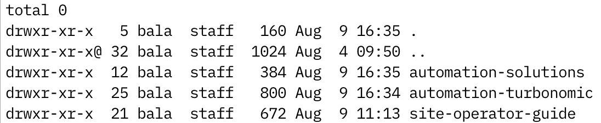
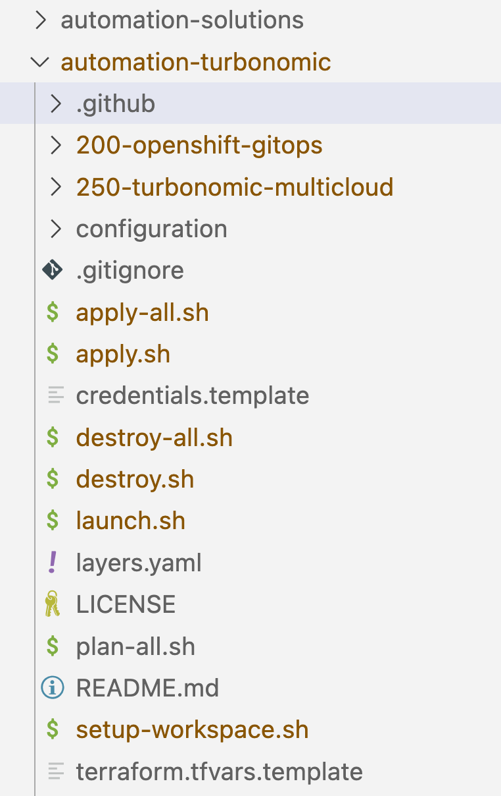
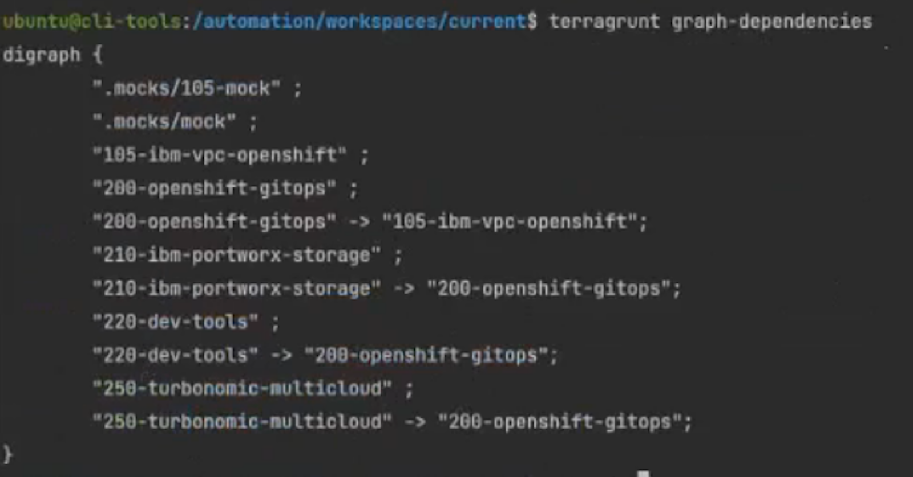

# End To End Testing for any Software Module

I have provided step by step instructions for the end to end testing for software (Turbonomic) module which can be replicated for any software such as CP4I, CP4D etc.

- Turbonomic Repo - https://github.com/IBM/automation-turbonomic

### Follow the steps to implement the end-to-end testing

(1) Checkout the Git repo from the https://github.com/cloud-native-toolkit/automation-solutions

``` 
git clone https://github.com/cloud-native-toolkit/automation-solutions.git

```

Output from above Git Clone CLI

```
Cloning into 'automation-solutions'...
remote: Enumerating objects: 3778, done.
remote: Counting objects: 100% (1114/1114), done.
remote: Compressing objects: 100% (326/326), done.
remote: Total 3778 (delta 722), reused 1070 (delta 700), pack-reused 2664
Receiving objects: 100% (3778/3778), 10.72 MiB | 10.41 MiB/s, done.
Resolving deltas: 100% (2441/2441), done
```

(2) Clone the Git repo for the software (such as turbonomic) which needs to be end-to-end testing

``` 
git clone https://github.com/IBM/automation-turbonomic.git

```

***Note:*** 

- Make sure the you keep the automation solutions and automation-turbonomic in the same level directory since we will be generating the files that will go directly to automation-turbonomic folder. 
- Otherwise, you need to copy the files and manually move to automation-turbonomic folder.



(3) Navigate to the software folder named "Turbonomic" in my case and launch the script "generate.sh"

```
.\generate.sh
```

Output from the generate.sh CLI 

```
Loading catalog from url: https://modules.cloudnativetoolkit.dev/index.yaml
Name: 200-openshift-gitops
Writing output to: ../../../../automation-turbonomic
Loading catalog from url: https://modules.cloudnativetoolkit.dev/index.yaml
Name: 250-turbonomic-multicloud
Writing output to: ../../../../automation-turbonomic
Copying Files
Copying Configuration
```

**Note:** Every software layer which requires common layer such as Gitops, Storage as well as configuration will have symbolic to the Shared location.

(4) Navigate to the software (automation-turbonomic) and verify the files are generated as well as .github folder exist which is requires for the end-to-end test to run.



(5) Add the end to end test logic in the verify-workflow.yaml (automation-turbonomic\.github\workflows) of the Software module to be tested

- Below example strategy with do the end-to-end testing for the Turbonomic software on IBM Cloud infrastructure with the storage ODF and Portworx.
  
```
   Strategy: 
      matrix:
        flavor:
          - ibm
        storage:
           - odf
           - portworx 
```

(6) Add environment variables needed for this module in the verify-pr.yaml

```
    env:
         Home: 
         IBMCloud_API_Key
```

(7) Steps represents a sequence of tasks that will be executed as part of job

- Add the steps which needs to be executed in the sequence 

(8) Modify the 200-openshift-gitops BOM to support Gitea

- Make sure generated main.tf is referencing the Gitea variables inside Gitops Module in the main.tf
  
```
  module "gitops_repo" {
  source = "github.com/cloud-native-toolkit/terraform-tools-gitops?ref=v1.21.0"
  branch = var.gitops_repo_branch
  debug = var.debug
  gitea_host = module.gitea.host
  gitea_org = module.gitea.org
  gitea_token = module.gitea.token
  gitea_username = module.gitea.username
  ——
  }
```

(9) Copy the .mocks folder which has the configuration for BOM layer dependency.
  - If you have any specific dependency between layers, you can describe in the terragrunt.hcl

**Note:** You can also validate the dependency if its configured properly by launching the container (.launch.sh) and run the CLI terragrunt graph-dependencies which displays the dependency graph




(10) Trigger the module build which will kick off the end-to-end test for the software to be tested.
  - Watch the Github Actions TAB 
