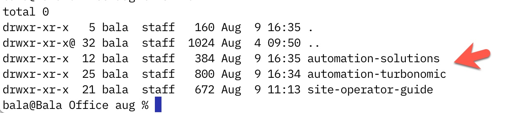

# End To End Testing for any software module

Turbonomic Repo - https://github.com/IBM/automation-turbonomic


Follow the steps to implement the end-to-end testing for Turbonomic / CP4I

(1) Checkout the Git repo from the https://github.com/cloud-native-toolkit/automation-solutions

``` 
git clone https://github.com/cloud-native-toolkit/automation-solutions.git

```

Output from above Git Clone CLI

```
Cloning into 'automation-solutions'...
remote: Enumerating objects: 3778, done.
remote: Counting objects: 100% (1114/1114), done.
remote: Compressing objects: 100% (326/326), done.
remote: Total 3778 (delta 722), reused 1070 (delta 700), pack-reused 2664
Receiving objects: 100% (3778/3778), 10.72 MiB | 10.41 MiB/s, done.
Resolving deltas: 100% (2441/2441), done
```

(2) Clone the Git repo for the software (such as turbonomic) which needs to be end-to-end testing

``` 
git clone https://github.com/IBM/automation-turbonomic.git

```

***Note:*** Make sure the you keep the automation solutions and automation-turbonomic in the same level directory since we will be generating the files that will go directly to automation-turbonomic folder. Otherwise, you need to copy the files and manually move to automation-turbonomic folder.




(1)  Copy the .github to the IBM Github which will trigger the Action/Test in the IBM Github Repo where software module to be tested.
```
    - workflows
       - verify-pr.yaml
       - verify-schedule.yaml
       - verify-workflow.yaml
       - verify.yaml
   - release-drafter.yaml 
```

 (2) Add the end to end test logic in the verify-workflow.yaml of the Software module to be tested
  
  ```
   Strategy: 
      matrix:
        flavor:
          - quickstart
        storage:
           - odf
           - portworx 
   ```

(3) Add environment variables needed for this module in the verify-pr.yaml
```
    env:
         Home: 
         IBMCloud_API_Key
```

(4) Steps represents a sequence of tasks that will be executed as part of job
  - Add the steps which needs to be executed in the sequence 


(5) Modify the 200-openshift-gitops BOM to support Gitea
  - Make sure generated main.tf is referrencing the Gitea variables inside Gitops Module in the main.tf

```
  module "gitops_repo" {
  source = "github.com/cloud-native-toolkit/terraform-tools-gitops?ref=v1.21.0"
  branch = var.gitops_repo_branch
  debug = var.debug
  gitea_host = module.gitea.host
  gitea_org = module.gitea.org
  gitea_token = module.gitea.token
  gitea_username = module.gitea.username
  ——
  }
```

(6) Trigger the module build which will kick off the end-to-end test for the software to be tested.
  - Watch the Github Actions TAB 
