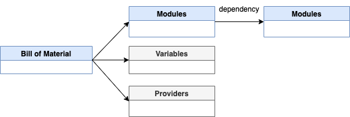

# Lab 1: Getting start with the basics

This is just a starting point to use `[IasCable](https://github.com/cloud-native-toolkit/iascable)`.

## 1. The `IasCable` framework

Let us have first a look the basic components of the `IasCable` framework.

### [Bill of Material](../../../apply/bill-of-material-reference/) and [Modules](https://modules.cloudnativetoolkit.dev/)

The IasCable uses a [`Bill of Material`](../../../apply/bill-of-material-reference/) and [`Modules`](https://modules.cloudnativetoolkit.dev/)(from the [TechZone Accelerator ToolKit](https://github.com/cloud-native-toolkit/software-everywhere)), which you need to understand. These two parts are the heart of the framework we could say to realize the objective to  build an installable component infrastructure based on components from a catalog of available modules.

> Please visit the linked resources for more details.

Simplified we can say a `BOM` is specified by modules it uses, variables you can define and providers you can define. In addition you have the option to use variables and providers definitions related to a `BOM` specification. It is good to know that Modules can have dependencies to other modules, if this is the case the related modules will be included by the framework, as far as I understand.

Simplified we can say a [BOM is specified](../../../apply/bill-of-material-reference/#bom-spec) by modules it uses. In addition you have the option to use variables and providers definitions related to a BOM specification. It is good to know that Modules can have dependencies to other modules, if this is the case the related modules will be included by the framework, as far as I understand.

Here is a simplified overview diagram of the dependencies:



Here is a simplified activity diagram that shows the activities carried out by the user and the `IasCable` framework.


### Realize [Software Everywhere](https://github.com/cloud-native-toolkit/software-everywhere) with [Bill of Material](https://github.com/cloud-native-toolkit/iascable#bill-of-material-structure) and [Modules](https://modules.cloudnativetoolkit.dev/)

Simplified we can say, we have two basic roles in that context:

1. `Creators` (Architect, Developer
or Operator) defining [Bill of Materials](https://github.com/cloud-native-toolkit/iascable#bill-of-material-structure) to create Terraform automation for creating specific infrastructure based on reusing existing Terraform modules.
2. `Consumers` who using the created Terraform automation based on the `BOM` definition.

And we have two major elements to define and create the needed Terraform automation.

1. The `BOM` configures `IasCable` to point to right Terraform modules in a module catalog to create the Terraform automation code.
2. `IasCable` is uses Terraform modules to create a Terraform automation which will be consumed.

The following diagram shows some high level dependencies.


## 2. Pre-requisites for the example

Following tools need to be installed on your local computer to follow the step by step instructions.

* [`Terraform`](https://www.terraform.io/)
* Git

That is the cloud environment we will use.

* [IBM Cloud](https://cloud.ibm.com/login)

## 3. `Step-by-step` example setup

This is a step by step example setup to create a `Virtual Private Cloud` with three `Subnets` on IBM Cloud.

* 1 x [`Virtual Private Cloud`](https://www.ibm.com/cloud/learn/vpc)
* 3 x [`Subnets`](https://cloud.ibm.com/docs/subnets?topic=subnets-getting-started)
* 2 x [`Access Control Lists`](https://cloud.ibm.com/docs/vpc?topic=vpc-using-acls)
* 1 x [`Routing Table`](https://cloud.ibm.com/docs/vpc?topic=vpc-about-custom-routes)
* 2 x [`Security Groups`](https://cloud.ibm.com/docs/security-groups?topic=security-groups-about-ibm-security-groups)

* Simplified architecture overview


### Step 1: Install CLI

```sh
curl -sL https://iascable.cloudnativetoolkit.dev/install.sh | sh
```

### Step 2: Verify the installation

```sh
iascable build --help
```

* Example output:

```sh
Configure (and optionally deploy) the iteration zero assets

Options:
      --version                   Show version number   [boolean]
      --help                      Show help             [boolean]
  -u, --catalogUrl                The url of the module catalog.
                                  Can be https:// or file:/
                                  protocol.
   [default: "https://modules.cloudnativetoolkit.dev/index.yaml"]
  -i, --input                     The path to the bill of
                                  materials to use as input
                                                          [array]
  -r, --reference                 The reference BOM to use for
                                  the build               [array]
  -o, --outDir                    The base directory where the
                                  command output will be written
                                            [default: "./output"]
      --platform                  Filter for the platform
                                  (kubernetes or ocp4)
      --provider                  Filter for the provider (ibm or
                                  k8s)
      --tileLabel                 The label for the tile.
                                  Required if you want to
                                  generate the tile metadata.
      --name                      The name used to override the
                                  module name in the bill of
                                  material.               [array]
      --tileDescription           The description of the tile.
      --flattenOutput, --flatten  Flatten the generated output
                                  into a single directory (i.e.
                                  remove the terraform folder).
                                                        [boolean]
      --debug                     Flag to turn on more detailed
                                  output message        [boolean]
```

### Step 3: Create a `Bill of Materials`(BOM) file 

```sh
nano firstbom.yaml
```

Copy following content into the new file:

```yaml
apiVersion: cloudnativetoolkit.dev/v1alpha1
kind: BillOfMaterial
metadata:
  name: ibm-vpc
spec:
  modules:
    - name: ibm-vpc
    - name: ibm-vpc-subnets
```

### Step 4: Execute following command

```sh
iascable build -i firstbom.yaml
```

### Step 5: Verify the created content

```sh
├── firstbom.yaml
└── output
    ├── ibm-vpc
    │   ├── apply.sh
    │   ├── bom.yaml
    │   ├── dependencies.dot
    │   ├── destroy.sh
    │   └── terraform
    │       ├── docs
    │       │   ├── ibm-resource-group.md
    │       │   ├── ibm-vpc-subnets.md
    │       │   └── ibm-vpc.md
    │       ├── ibm-vpc.auto.tfvars
    │       ├── main.tf
    │       ├── providers.tf
    │       ├── variables.tf
    │       └── version.tf
    └── launch.sh
```

* `output` folder

The folder `output` contains all the content created by the `iascable build` command

* `output/ibm-vpc` folder

The folder `ibm-vpc` is the name we used in our own `BOM` file. Let us call that folder project folder, which was defined in meta data.

```yaml
metadata:
  name: ibm-vpc
```

* `output/ibm-vpc/terraform` folder

This is table contains the list of files in the terraform folder.

| Filename | Content |
| --- | --- |
| `output/ibm-vpc/terraform/main.tf` | Here you see a number of modules defined including the defined `ibm-vpc` and `ibm-vpc-subnets` from the BOM file. |
| `output/ibm-vpc/terraform/providers.tf` | Simply contains the needed cloud provider information. In that case what we need to specify for `IBM Cloud`. |
| `output/ibm-vpc/terraform/variables.ft` | Contains the specification for the used variable in the `main.tf` or other Terraform files. |
| `output/ibm-vpc/terraform/version.ft` | Contains the specification for the used Terraform provider sources and versions. In that case only IBM is listed.|
| `output/ibm-vpc/terraform/ibm-vpc.auto.tfvars` | That file can be used to configure the variable values. (maybe add to .gitignore) During the execution of `terraform plan` and `terraform apply` you will be ask for input, if you didn't specify that values. |

* The `output/launch.sh` file

That script downloads and starts a container on your local machine. The objective to ensure that the right environment is used for applying the Terraform configuration.

It attaches the local path to the container as a volume.

> Note: Need to ensure you have a container engine on your machine. Best Docker! Because by default is uses Docker. Attach doesn't work for `podman` on macOS.

* The `output/ibm-vpc/apply.sh` file

That file converts an existing `variable.yaml` file or variable in the `BOM` file to a `variables.tf` and then executes `terraform init` and `terraform apply`.

* The `output/ibm-vpc/destroy.sh` file

That file simply executes the `terraform init` and 
`terraform destroy -auto-approve` commands.

* The `output/ibm-vpc/dependencies.dot` file

That file contains the dependencies which can be visualized for example with [Graphviz Online](https://dreampuf.github.io/GraphvizOnline/).

Example: 

* The `output/bom.yaml` file

That file was created by our own `BOM file`. That file now contains all needed variables. These variables are also reflected in the `output/ibm-vpc/terraform/variables.ft` file.

Here is the content of the newly created `bom.yaml` file.

```yaml
apiVersion: cloudnativetoolkit.dev/v1alpha1
kind: BillOfMaterial
metadata:
  name: ibm-vpc
spec:
  modules:
    - name: ibm-vpc
      alias: ibm-vpc
      version: v1.16.0
    - name: ibm-vpc-subnets
      alias: ibm-vpc-subnets
      version: v1.13.2
    - name: ibm-resource-group
      alias: resource_group
      version: v3.2.16
  variables:
    - name: region
      type: string
      description: The IBM Cloud region where the cluster will be/has been installed.
    - name: ibmcloud_api_key
      type: string
    - name: ibm-vpc-subnets__count
      type: number
      description: The number of subnets that should be provisioned
      defaultValue: 3
    - name: resource_group_name
      type: string
      description: The name of the resource group
```

### Step 6: Execute the `terraform init` command

Navigate to the `output/ibm-vpc/terraform` folder and execute the `terraform init` command.

```sh
cd output/ibm-vpc/terraform
terraform init
```

### Step 7: Execute the `terraform plan`  command

Execute the `terraform plan` command.

```sh
terraform plan
```

Here you can see the interaction:

```sh
var.ibmcloud_api_key
  the value of ibmcloud_api_key

  Enter a value: 
```

> Note: You can create an `IBM Cloud API Key` with following command: `ibmcloud iam api-key-create iascable-example`.


### Step 8: Execute the `terraform apply`

Execute the `terraform apply` command.

```sh
terraform apply -auto-approve
```

* Input of your variables:

```sh
var.ibmcloud_api_key
  the value of ibmcloud_api_key

  Enter a value: xxx
var.region
  The IBM Cloud region where the cluster will be/has been installed.

  Enter a value: us-south 
var.resource_group_name
  The name of the resource group

  Enter a value: default
```

* Output overview of the resources which will be created:

```sh
Terraform used the selected providers to generate the following
execution plan. Resource actions are indicated with the
following symbols:
  + create
 <= read (data resources)

Terraform will perform the following actions:

  # module.ibm-vpc.data.ibm_is_security_group.base will be read during apply
  # (config refers to values not yet known)
 <= data "ibm_is_security_group" "base"  {
      + crn                     = (known after apply)
      + id                      = (known after apply)
      + name                    = "default-vpc-base"
      + resource_controller_url = (known after apply)
      + resource_crn            = (known after apply)
      + resource_group_name     = (known after apply)
      + resource_name           = (known after apply)
      + rules                   = (known after apply)
      + tags                    = (known after apply)
      + vpc                     = (known after apply)
    }

  # module.ibm-vpc.data.ibm_is_vpc.vpc will be read during apply
  # (config refers to values not yet known)
 <= data "ibm_is_vpc" "vpc"  {
      + classic_access              = (known after apply)
      + crn                         = (known after apply)
      + cse_source_addresses        = (known after apply)
      + default_network_acl         = (known after apply)
      + default_network_acl_crn     = (known after apply)
      + default_network_acl_name    = (known after apply)
      + default_routing_table       = (known after apply)
      + default_routing_table_name  = (known after apply)
      + default_security_group      = (known after apply)
      + default_security_group_crn  = (known after apply)
      + default_security_group_name = (known after apply)
      + id                          = (known after apply)
      + name                        = "default-vpc"
      + resource_controller_url     = (known after apply)
      + resource_crn                = (known after apply)
      + resource_group              = (known after apply)
      + resource_group_name         = (known after apply)
      + resource_name               = (known after apply)
      + resource_status             = (known after apply)
      + security_group              = (known after apply)
      + status                      = (known after apply)
      + subnets                     = (known after apply)
      + tags                        = (known after apply)
    }

  # module.ibm-vpc.data.ibm_resource_group.resource_group will be read during apply
  # (config refers to values not yet known)
 <= data "ibm_resource_group" "resource_group"  {
      + account_id          = (known after apply)
      + created_at          = (known after apply)
      + crn                 = (known after apply)
      + id                  = (known after apply)
      + is_default          = (known after apply)
      + name                = "default"
      + payment_methods_url = (known after apply)
      + quota_id            = (known after apply)
      + quota_url           = (known after apply)
      + resource_linkages   = (known after apply)
      + state               = (known after apply)
      + teams_url           = (known after apply)
      + updated_at          = (known after apply)
    }

  # module.ibm-vpc.ibm_is_network_acl_rule.allow_internal_egress[0] will be created
  + resource "ibm_is_network_acl_rule" "allow_internal_egress" {
      + action      = "allow"
      + before      = (known after apply)
      + destination = "10.0.0.0/8"
      + direction   = "outbound"
      + href        = (known after apply)
      + id          = (known after apply)
      + ip_version  = (known after apply)
      + name        = "allow-internal-egress"
      + network_acl = (known after apply)
      + protocol    = (known after apply)
      + rule_id     = (known after apply)
      + source      = "10.0.0.0/8"
    }

  # module.ibm-vpc.ibm_is_network_acl_rule.allow_internal_ingress[0] will be created
  + resource "ibm_is_network_acl_rule" "allow_internal_ingress" {
      + action      = "allow"
      + before      = (known after apply)
      + destination = "10.0.0.0/8"
      + direction   = "inbound"
      + href        = (known after apply)
      + id          = (known after apply)
      + ip_version  = (known after apply)
      + name        = "allow-internal-ingress"
      + network_acl = (known after apply)
      + protocol    = (known after apply)
      + rule_id     = (known after apply)
      + source      = "10.0.0.0/8"
    }

  # module.ibm-vpc.ibm_is_network_acl_rule.deny_external_ingress[0] will be created
  + resource "ibm_is_network_acl_rule" "deny_external_ingress" {
      + action      = "deny"
      + before      = (known after apply)
      + destination = "0.0.0.0/0"
      + direction   = "inbound"
      + href        = (known after apply)
      + id          = (known after apply)
      + ip_version  = (known after apply)
      + name        = "deny-external-ingress"
      + network_acl = (known after apply)
      + protocol    = (known after apply)
      + rule_id     = (known after apply)
      + source      = "0.0.0.0/0"
    }

  # module.ibm-vpc.ibm_is_network_acl_rule.deny_external_rdp[0] will be created
  + resource "ibm_is_network_acl_rule" "deny_external_rdp" {
      + action      = "deny"
      + before      = (known after apply)
      + destination = "0.0.0.0/0"
      + direction   = "inbound"
      + href        = (known after apply)
      + id          = (known after apply)
      + ip_version  = (known after apply)
      + name        = "deny-external-rdp"
      + network_acl = (known after apply)
      + protocol    = (known after apply)
      + rule_id     = (known after apply)
      + source      = "0.0.0.0/0"

      + tcp {
          + port_max        = 3389
          + port_min        = 3389
          + source_port_max = 3389
          + source_port_min = 3389
        }
    }

  # module.ibm-vpc.ibm_is_network_acl_rule.deny_external_ssh[0] will be created
  + resource "ibm_is_network_acl_rule" "deny_external_ssh" {
      + action      = "deny"
      + before      = (known after apply)
      + destination = "0.0.0.0/0"
      + direction   = "inbound"
      + href        = (known after apply)
      + id          = (known after apply)
      + ip_version  = (known after apply)
      + name        = "deny-external-ssh"
      + network_acl = (known after apply)
      + protocol    = (known after apply)
      + rule_id     = (known after apply)
      + source      = "0.0.0.0/0"

      + tcp {
          + port_max        = 22
          + port_min        = 22
          + source_port_max = 22
          + source_port_min = 22
        }
    }

  # module.ibm-vpc.ibm_is_security_group.base[0] will be created
  + resource "ibm_is_security_group" "base" {
      + crn                     = (known after apply)
      + id                      = (known after apply)
      + name                    = "default-vpc-base"
      + resource_controller_url = (known after apply)
      + resource_crn            = (known after apply)
      + resource_group          = (known after apply)
      + resource_group_name     = (known after apply)
      + resource_name           = (known after apply)
      + rules                   = (known after apply)
      + tags                    = (known after apply)
      + vpc                     = (known after apply)
    }

  # module.ibm-vpc.ibm_is_security_group_rule.cse_dns_1[0] will be created
  + resource "ibm_is_security_group_rule" "cse_dns_1" {
      + direction   = "outbound"
      + group       = (known after apply)
      + id          = (known after apply)
      + ip_version  = "ipv4"
      + protocol    = (known after apply)
      + related_crn = (known after apply)
      + remote      = "161.26.0.10"
      + rule_id     = (known after apply)

      + udp {
          + port_max = 53
          + port_min = 53
        }
    }

  # module.ibm-vpc.ibm_is_security_group_rule.cse_dns_1[1] will be created
  + resource "ibm_is_security_group_rule" "cse_dns_1" {
      + direction   = "outbound"
      + group       = (known after apply)
      + id          = (known after apply)
      + ip_version  = "ipv4"
      + protocol    = (known after apply)
      + related_crn = (known after apply)
      + remote      = "161.26.0.10"
      + rule_id     = (known after apply)

      + udp {
          + port_max = 53
          + port_min = 53
        }
    }

  # module.ibm-vpc.ibm_is_security_group_rule.cse_dns_2[0] will be created
  + resource "ibm_is_security_group_rule" "cse_dns_2" {
      + direction   = "outbound"
      + group       = (known after apply)
      + id          = (known after apply)
      + ip_version  = "ipv4"
      + protocol    = (known after apply)
      + related_crn = (known after apply)
      + remote      = "161.26.0.11"
      + rule_id     = (known after apply)

      + udp {
          + port_max = 53
          + port_min = 53
        }
    }

  # module.ibm-vpc.ibm_is_security_group_rule.cse_dns_2[1] will be created
  + resource "ibm_is_security_group_rule" "cse_dns_2" {
      + direction   = "outbound"
      + group       = (known after apply)
      + id          = (known after apply)
      + ip_version  = "ipv4"
      + protocol    = (known after apply)
      + related_crn = (known after apply)
      + remote      = "161.26.0.11"
      + rule_id     = (known after apply)

      + udp {
          + port_max = 53
          + port_min = 53
        }
    }

  # module.ibm-vpc.ibm_is_security_group_rule.default_inbound_http[0] will be created
  + resource "ibm_is_security_group_rule" "default_inbound_http" {
      + direction   = "inbound"
      + group       = (known after apply)
      + id          = (known after apply)
      + ip_version  = "ipv4"
      + protocol    = (known after apply)
      + related_crn = (known after apply)
      + remote      = "0.0.0.0/0"
      + rule_id     = (known after apply)

      + tcp {
          + port_max = 80
          + port_min = 80
        }
    }

  # module.ibm-vpc.ibm_is_security_group_rule.default_inbound_ping[0] will be created
  + resource "ibm_is_security_group_rule" "default_inbound_ping" {
      + direction   = "inbound"
      + group       = (known after apply)
      + id          = (known after apply)
      + ip_version  = "ipv4"
      + protocol    = (known after apply)
      + related_crn = (known after apply)
      + remote      = "0.0.0.0/0"
      + rule_id     = (known after apply)

      + icmp {
          + type = 8
        }
    }

  # module.ibm-vpc.ibm_is_security_group_rule.private_dns_1[0] will be created
  + resource "ibm_is_security_group_rule" "private_dns_1" {
      + direction   = "outbound"
      + group       = (known after apply)
      + id          = (known after apply)
      + ip_version  = "ipv4"
      + protocol    = (known after apply)
      + related_crn = (known after apply)
      + remote      = "161.26.0.7"
      + rule_id     = (known after apply)

      + udp {
          + port_max = 53
          + port_min = 53
        }
    }

  # module.ibm-vpc.ibm_is_security_group_rule.private_dns_1[1] will be created
  + resource "ibm_is_security_group_rule" "private_dns_1" {
      + direction   = "outbound"
      + group       = (known after apply)
      + id          = (known after apply)
      + ip_version  = "ipv4"
      + protocol    = (known after apply)
      + related_crn = (known after apply)
      + remote      = "161.26.0.7"
      + rule_id     = (known after apply)

      + udp {
          + port_max = 53
          + port_min = 53
        }
    }

  # module.ibm-vpc.ibm_is_security_group_rule.private_dns_2[0] will be created
  + resource "ibm_is_security_group_rule" "private_dns_2" {
      + direction   = "outbound"
      + group       = (known after apply)
      + id          = (known after apply)
      + ip_version  = "ipv4"
      + protocol    = (known after apply)
      + related_crn = (known after apply)
      + remote      = "161.26.0.8"
      + rule_id     = (known after apply)

      + udp {
          + port_max = 53
          + port_min = 53
        }
    }

  # module.ibm-vpc.ibm_is_security_group_rule.private_dns_2[1] will be created
  + resource "ibm_is_security_group_rule" "private_dns_2" {
      + direction   = "outbound"
      + group       = (known after apply)
      + id          = (known after apply)
      + ip_version  = "ipv4"
      + protocol    = (known after apply)
      + related_crn = (known after apply)
      + remote      = "161.26.0.8"
      + rule_id     = (known after apply)

      + udp {
          + port_max = 53
          + port_min = 53
        }
    }

  # module.ibm-vpc.ibm_is_vpc.vpc[0] will be created
  + resource "ibm_is_vpc" "vpc" {
      + address_prefix_management   = "auto"
      + classic_access              = false
      + crn                         = (known after apply)
      + cse_source_addresses        = (known after apply)
      + default_network_acl         = (known after apply)
      + default_network_acl_crn     = (known after apply)
      + default_network_acl_name    = "default-vpc-default"
      + default_routing_table       = (known after apply)
      + default_routing_table_name  = "default-vpc-default"
      + default_security_group      = (known after apply)
      + default_security_group_crn  = (known after apply)
      + default_security_group_name = "default-vpc-default"
      + id                          = (known after apply)
      + name                        = "default-vpc"
      + resource_controller_url     = (known after apply)
      + resource_crn                = (known after apply)
      + resource_group              = (known after apply)
      + resource_group_name         = (known after apply)
      + resource_name               = (known after apply)
      + resource_status             = (known after apply)
      + security_group              = (known after apply)
      + status                      = (known after apply)
      + subnets                     = (known after apply)
      + tags                        = (known after apply)
    }

  # module.ibm-vpc.ibm_resource_tag.nacl-tag[0] will be created
  + resource "ibm_resource_tag" "nacl-tag" {
      + acccount_id = (known after apply)
      + id          = (known after apply)
      + resource_id = (known after apply)
      + tag_type    = (known after apply)
      + tags        = (known after apply)
    }

  # module.ibm-vpc.ibm_resource_tag.sg-tag[0] will be created
  + resource "ibm_resource_tag" "sg-tag" {
      + acccount_id = (known after apply)
      + id          = (known after apply)
      + resource_id = (known after apply)
      + tag_type    = (known after apply)
      + tags        = (known after apply)
    }

  # module.ibm-vpc.null_resource.print_names will be created
  + resource "null_resource" "print_names" {
      + id = (known after apply)
    }

  # module.ibm-vpc-subnets.data.ibm_is_vpc.vpc will be read during apply
  # (config refers to values not yet known)
 <= data "ibm_is_vpc" "vpc"  {
      + classic_access              = (known after apply)
      + crn                         = (known after apply)
      + cse_source_addresses        = (known after apply)
      + default_network_acl         = (known after apply)
      + default_network_acl_crn     = (known after apply)
      + default_network_acl_name    = (known after apply)
      + default_routing_table       = (known after apply)
      + default_routing_table_name  = (known after apply)
      + default_security_group      = (known after apply)
      + default_security_group_crn  = (known after apply)
      + default_security_group_name = (known after apply)
      + id                          = (known after apply)
      + name                        = "default-vpc"
      + resource_controller_url     = (known after apply)
      + resource_crn                = (known after apply)
      + resource_group              = (known after apply)
      + resource_group_name         = (known after apply)
      + resource_name               = (known after apply)
      + resource_status             = (known after apply)
      + security_group              = (known after apply)
      + status                      = (known after apply)
      + subnets                     = (known after apply)
      + tags                        = (known after apply)
    }

  # module.ibm-vpc-subnets.data.ibm_resource_group.resource_group will be read during apply
  # (config refers to values not yet known)
 <= data "ibm_resource_group" "resource_group"  {
      + account_id          = (known after apply)
      + created_at          = (known after apply)
      + crn                 = (known after apply)
      + id                  = (known after apply)
      + is_default          = (known after apply)
      + name                = "default"
      + payment_methods_url = (known after apply)
      + quota_id            = (known after apply)
      + quota_url           = (known after apply)
      + resource_linkages   = (known after apply)
      + state               = (known after apply)
      + teams_url           = (known after apply)
      + updated_at          = (known after apply)
    }

  # module.ibm-vpc-subnets.ibm_is_network_acl.subnet_acl[0] will be created
  + resource "ibm_is_network_acl" "subnet_acl" {
      + crn                     = (known after apply)
      + id                      = (known after apply)
      + name                    = "default-vpc-subnet-default"
      + resource_controller_url = (known after apply)
      + resource_crn            = (known after apply)
      + resource_group          = (known after apply)
      + resource_group_name     = (known after apply)
      + resource_name           = (known after apply)
      + tags                    = (known after apply)
      + vpc                     = (known after apply)

      + rules {
          + action      = (known after apply)
          + destination = (known after apply)
          + direction   = (known after apply)
          + id          = (known after apply)
          + ip_version  = (known after apply)
          + name        = (known after apply)
          + source      = (known after apply)
          + subnets     = (known after apply)

          + icmp {
              + code = (known after apply)
              + type = (known after apply)
            }

          + tcp {
              + port_max        = (known after apply)
              + port_min        = (known after apply)
              + source_port_max = (known after apply)
              + source_port_min = (known after apply)
            }

          + udp {
              + port_max        = (known after apply)
              + port_min        = (known after apply)
              + source_port_max = (known after apply)
              + source_port_min = (known after apply)
            }
        }
    }

  # module.ibm-vpc-subnets.ibm_is_network_acl_rule.acl_rule[0] will be created
  + resource "ibm_is_network_acl_rule" "acl_rule" {
      + action      = "allow"
      + before      = (known after apply)
      + destination = "10.0.0.0/8"
      + direction   = "inbound"
      + href        = (known after apply)
      + id          = (known after apply)
      + ip_version  = (known after apply)
      + name        = "default-vpc-subnet-default-allow-ingress-internal"
      + network_acl = (known after apply)
      + protocol    = (known after apply)
      + rule_id     = (known after apply)
      + source      = "10.0.0.0/8"
    }

  # module.ibm-vpc-subnets.ibm_is_network_acl_rule.acl_rule[1] will be created
  + resource "ibm_is_network_acl_rule" "acl_rule" {
      + action      = "allow"
      + before      = (known after apply)
      + destination = "10.0.0.0/8"
      + direction   = "inbound"
      + href        = (known after apply)
      + id          = (known after apply)
      + ip_version  = (known after apply)
      + name        = "default-vpc-subnet-default-allow-roks-ingress"
      + network_acl = (known after apply)
      + protocol    = (known after apply)
      + rule_id     = (known after apply)
      + source      = "166.8.0.0/14"
    }

  # module.ibm-vpc-subnets.ibm_is_network_acl_rule.acl_rule[2] will be created
  + resource "ibm_is_network_acl_rule" "acl_rule" {
      + action      = "allow"
      + before      = (known after apply)
      + destination = "10.0.0.0/8"
      + direction   = "inbound"
      + href        = (known after apply)
      + id          = (known after apply)
      + ip_version  = (known after apply)
      + name        = "default-vpc-subnet-default-allow-vse-ingress"
      + network_acl = (known after apply)
      + protocol    = (known after apply)
      + rule_id     = (known after apply)
      + source      = "161.26.0.0/16"
    }

  # module.ibm-vpc-subnets.ibm_is_network_acl_rule.acl_rule[3] will be created
  + resource "ibm_is_network_acl_rule" "acl_rule" {
      + action      = "allow"
      + before      = (known after apply)
      + destination = "10.0.0.0/8"
      + direction   = "outbound"
      + href        = (known after apply)
      + id          = (known after apply)
      + ip_version  = (known after apply)
      + name        = "default-vpc-subnet-default-allow-egress-internal"
      + network_acl = (known after apply)
      + protocol    = (known after apply)
      + rule_id     = (known after apply)
      + source      = "10.0.0.0/8"
    }

  # module.ibm-vpc-subnets.ibm_is_network_acl_rule.acl_rule[4] will be created
  + resource "ibm_is_network_acl_rule" "acl_rule" {
      + action      = "allow"
      + before      = (known after apply)
      + destination = "166.8.0.0/14"
      + direction   = "outbound"
      + href        = (known after apply)
      + id          = (known after apply)
      + ip_version  = (known after apply)
      + name        = "default-vpc-subnet-default-allow-roks-egress"
      + network_acl = (known after apply)
      + protocol    = (known after apply)
      + rule_id     = (known after apply)
      + source      = "10.0.0.0/8"
    }

  # module.ibm-vpc-subnets.ibm_is_network_acl_rule.acl_rule[5] will be created
  + resource "ibm_is_network_acl_rule" "acl_rule" {
      + action      = "allow"
      + before      = (known after apply)
      + destination = "161.26.0.0/16"
      + direction   = "outbound"
      + href        = (known after apply)
      + id          = (known after apply)
      + ip_version  = (known after apply)
      + name        = "default-vpc-subnet-default-allow-vse-egress"
      + network_acl = (known after apply)
      + protocol    = (known after apply)
      + rule_id     = (known after apply)
      + source      = "10.0.0.0/8"
    }

  # module.ibm-vpc-subnets.ibm_is_subnet.vpc_subnets[0] will be created
  + resource "ibm_is_subnet" "vpc_subnets" {
      + access_tags                  = (known after apply)
      + available_ipv4_address_count = (known after apply)
      + crn                          = (known after apply)
      + id                           = (known after apply)
      + ip_version                   = "ipv4"
      + ipv4_cidr_block              = (known after apply)
      + name                         = "default-vpc-subnet-default01"
      + network_acl                  = (known after apply)
      + public_gateway               = (known after apply)
      + resource_controller_url      = (known after apply)
      + resource_crn                 = (known after apply)
      + resource_group               = (known after apply)
      + resource_group_name          = (known after apply)
      + resource_name                = (known after apply)
      + resource_status              = (known after apply)
      + routing_table                = (known after apply)
      + status                       = (known after apply)
      + tags                         = (known after apply)
      + total_ipv4_address_count     = 256
      + vpc                          = (known after apply)
      + zone                         = "us-south-1"
    }

  # module.ibm-vpc-subnets.ibm_is_subnet.vpc_subnets[1] will be created
  + resource "ibm_is_subnet" "vpc_subnets" {
      + access_tags                  = (known after apply)
      + available_ipv4_address_count = (known after apply)
      + crn                          = (known after apply)
      + id                           = (known after apply)
      + ip_version                   = "ipv4"
      + ipv4_cidr_block              = (known after apply)
      + name                         = "default-vpc-subnet-default02"
      + network_acl                  = (known after apply)
      + public_gateway               = (known after apply)
      + resource_controller_url      = (known after apply)
      + resource_crn                 = (known after apply)
      + resource_group               = (known after apply)
      + resource_group_name          = (known after apply)
      + resource_name                = (known after apply)
      + resource_status              = (known after apply)
      + routing_table                = (known after apply)
      + status                       = (known after apply)
      + tags                         = (known after apply)
      + total_ipv4_address_count     = 256
      + vpc                          = (known after apply)
      + zone                         = "us-south-2"
    }

  # module.ibm-vpc-subnets.ibm_is_subnet.vpc_subnets[2] will be created
  + resource "ibm_is_subnet" "vpc_subnets" {
      + access_tags                  = (known after apply)
      + available_ipv4_address_count = (known after apply)
      + crn                          = (known after apply)
      + id                           = (known after apply)
      + ip_version                   = "ipv4"
      + ipv4_cidr_block              = (known after apply)
      + name                         = "default-vpc-subnet-default03"
      + network_acl                  = (known after apply)
      + public_gateway               = (known after apply)
      + resource_controller_url      = (known after apply)
      + resource_crn                 = (known after apply)
      + resource_group               = (known after apply)
      + resource_group_name          = (known after apply)
      + resource_name                = (known after apply)
      + resource_status              = (known after apply)
      + routing_table                = (known after apply)
      + status                       = (known after apply)
      + tags                         = (known after apply)
      + total_ipv4_address_count     = 256
      + vpc                          = (known after apply)
      + zone                         = "us-south-3"
    }

  # module.ibm-vpc-subnets.null_resource.print_names will be created
  + resource "null_resource" "print_names" {
      + id = (known after apply)
    }

  # module.resource_group.data.ibm_resource_group.resource_group will be read during apply
  # (config refers to values not yet known)
 <= data "ibm_resource_group" "resource_group"  {
      + account_id          = (known after apply)
      + created_at          = (known after apply)
      + crn                 = (known after apply)
      + id                  = (known after apply)
      + is_default          = (known after apply)
      + name                = "default"
      + payment_methods_url = (known after apply)
      + quota_id            = (known after apply)
      + quota_url           = (known after apply)
      + resource_linkages   = (known after apply)
      + state               = (known after apply)
      + teams_url           = (known after apply)
      + updated_at          = (known after apply)
    }

  # module.resource_group.data.ibm_resource_tag.resource_group_tags will be read during apply
  # (config refers to values not yet known)
 <= data "ibm_resource_tag" "resource_group_tags"  {
      + id          = (known after apply)
      + resource_id = (known after apply)
      + tags        = (known after apply)
    }

  # module.resource_group.null_resource.resource_group will be created
  + resource "null_resource" "resource_group" {
      + id       = (known after apply)
      + triggers = (known after apply)
    }

  # module.resource_group.null_resource.wait_for_sync will be created
  + resource "null_resource" "wait_for_sync" {
      + id = (known after apply)
    }

  # module.resource_group.random_uuid.tag will be created
  + resource "random_uuid" "tag" {
      + id     = (known after apply)
      + result = (known after apply)
    }

  # module.resource_group.module.clis.data.external.setup-binaries will be read during apply
  # (config refers to values not yet known)
 <= data "external" "setup-binaries"  {
      + id      = (known after apply)
      + program = [
          + "bash",
          + ".terraform/modules/resource_group.clis/scripts/setup-binaries.sh",
        ]
      + query   = {
          + "bin_dir" = "/Users/thomassuedbroecker/Downloads/dev/iascable-starting-point/examples/output/ibm-vpc/terraform/bin2"
          + "clis"    = "yq,jq,igc"
          + "uuid"    = (known after apply)
        }
      + result  = (known after apply)
    }

  # module.resource_group.module.clis.null_resource.print will be created
  + resource "null_resource" "print" {
      + id = (known after apply)
    }

  # module.resource_group.module.clis.random_string.uuid will be created
  + resource "random_string" "uuid" {
      + id          = (known after apply)
      + length      = 16
      + lower       = true
      + min_lower   = 0
      + min_numeric = 0
      + min_special = 0
      + min_upper   = 0
      + number      = false
      + numeric     = (known after apply)
      + result      = (known after apply)
      + special     = false
      + upper       = false
    }

Plan: 36 to add, 0 to change, 0 to destroy.
╷
│ Warning: Experimental feature "module_variable_optional_attrs" is active
│ 
│   on .terraform/modules/ibm-vpc-subnets/version.tf line 10, in terraform:
│   10:   experiments = [module_variable_optional_attrs]
│ 
│ Experimental features are subject to breaking changes in
│ future minor or patch releases, based on feedback.
│ 
│ If you have feedback on the design of this feature, please
│ open a GitHub issue to discuss it.
╵
╷
│ Warning: Argument is deprecated
│ 
│   with module.resource_group.module.clis.random_string.uuid,
│   on .terraform/modules/resource_group.clis/main.tf line 15, in resource "random_string" "uuid":
│   15:   number  = false
│ 
│ Use numeric instead.
│ 
│ (and one more similar warning elsewhere)
Do you want to perform these actions?
  Terraform will perform the actions described above.
  Only 'yes' will be accepted to approve.

  Enter a value: yes
```

* Final result of the creation

```sh
Apply complete! Resources: 36 added, 0 changed, 0 destroyed.
```

### Step 9: Execute the `terraform destroy` command


> Note: Ensure you didn't delete the `terraform.tfstate` and the `.terraform.lock.hcl` files before.

To destroy the provisioned resources, run the following:

```sh
terraform destroy -auto-approve
```

>You need to ensure to provide the IBM Cloud API Key, the region and the resource group name.

```sh
var.ibmcloud_api_key
  the value of ibmcloud_api_key

  Enter a value: xxxx

var.region
  The IBM Cloud region where the cluster will be/has been installed.

  Enter a value: us-south

var.resource_group_name
  The name of the resource group

  Enter a value: default
```

* Output overview:

```sh
╷
│ Warning: Experimental feature "module_variable_optional_attrs" is active
│ 
│   on .terraform/modules/ibm-vpc-subnets/version.tf line 10, in terraform:
│   10:   experiments = [module_variable_optional_attrs]
│ 
│ Experimental features are subject to breaking changes in
│ future minor or patch releases, based on feedback.
│ 
│ If you have feedback on the design of this feature, please
│ open a GitHub issue to discuss it.
╵
╷
│ Warning: Argument is deprecated
│ 
│   with module.resource_group.module.clis.random_string.uuid,
│   on .terraform/modules/resource_group.clis/main.tf line 15, in resource "random_string" "uuid":
│   15:   number  = false
│ 
│ Use numeric instead.
│ 
│ (and one more similar warning elsewhere)
╵

Destroy complete! Resources: 36 destroyed.
```

## 4. Summary

The `IasCable` and the [`Modules`](https://modules.cloudnativetoolkit.dev/) (from the Software Everywhere project) which are all from the Cloud Native Toolkit providing a good concept for a framework to provide reusable components to install and configure cloud infrastructure. This was just a getting started. There is more to learn.
