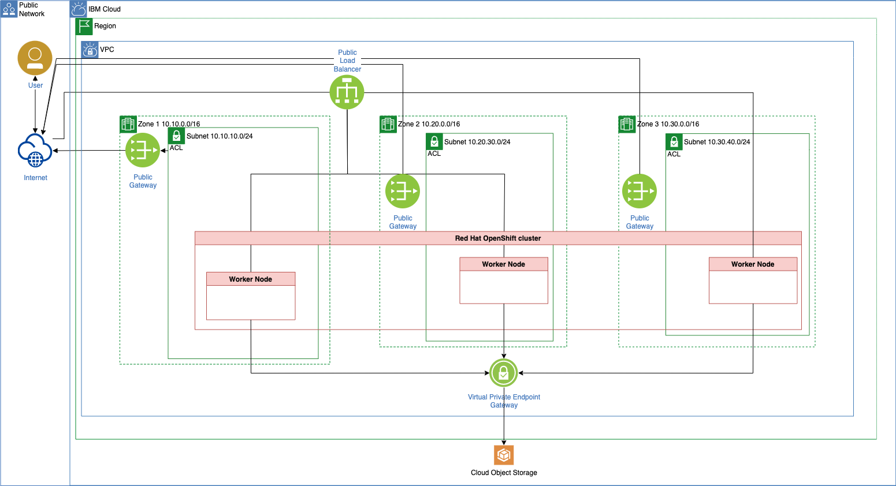
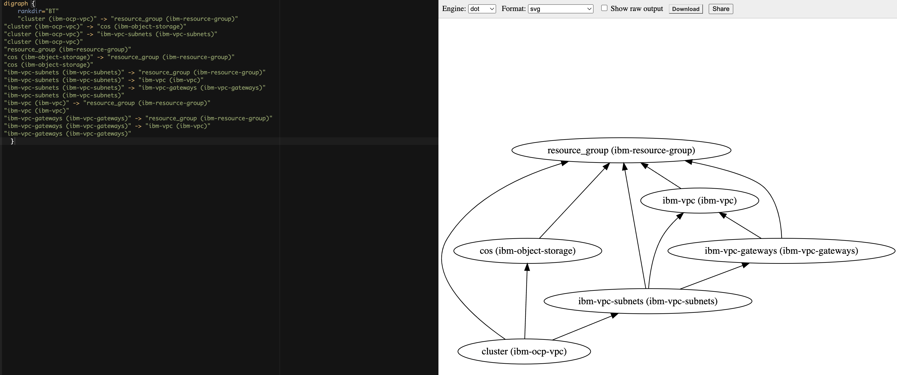

# Lab 2: Use IasCable to create a VPC and a Red Hat OpenShift cluster on IBM Cloud

The following list represents the modules which are referenced in the example [IBM ROKS Bill of Materials](https://github.com/cloud-native-toolkit/iascable#ibm-roks-bill-of-materials) for [IasCable](https://github.com/cloud-native-toolkit/iascable).

* [IBM VPC `ibm-vpc`](https://github.com/cloud-native-toolkit/terraform-ibm-vpc)
* [IBM VPC Subnets `ibm-vpc-subnets`](https://github.com/cloud-native-toolkit/terraform-ibm-vpc-subnets)
* [IBM Cloud VPC Public Gateway `ibm-vpc-gateways`](https://github.com/cloud-native-toolkit/terraform-ibm-vpc-gateways)
* [IBM OpenShift VPC cluster `ibm-ocp-vpc`](https://github.com/cloud-native-toolkit/terraform-ibm-ocp-vpc)

## 1. Pre-requisites for the example

Following tools need to be installed on your local computer to follow the step by step instructions.

* [Terraform](https://www.terraform.io/)
* [Git](https://git-scm.com/)

That is the cloud environment we will use.

* [IBM Cloud](https://www.ibm.com/cloud)

## 2. `Step-by-step` example setup

This is a step by step example setup to create a [`Virtual Private Cloud`](https://www.ibm.com/cloud/learn/vpc) and an [`IBM Cloud managed Red Hat OpenShift cluster`](https://www.ibm.com/cloud/openshift).

* 1 x [`Virtual Private Cloud`](https://www.ibm.com/cloud/learn/vpc)
* 3 x [`Subnets`](https://cloud.ibm.com/docs/subnets?topic=subnets-getting-started)
* 2 x [`Access Control Lists`](https://cloud.ibm.com/docs/vpc?topic=vpc-using-acls)
* 1 x [`Routing Table`](https://cloud.ibm.com/docs/vpc?topic=vpc-about-custom-routes)
* 2 x [`Security Groups`](https://cloud.ibm.com/docs/security-groups?topic=security-groups-about-ibm-security-groups)
* 3 x [`Public Gateway`](https://cloud.ibm.com/docs/vpc?topic=vpc-about-networking-for-vpc)
* 1 x [`Virtual Private Endpoint Gateway`](https://cloud.ibm.com/docs/vpc?topic=vpc-about-vpe)
* 1 x [`Red Hat OpenShift cluster`](https://www.ibm.com/cloud/openshift)
  
  * 3 x [`Worker Nodes`](https://cloud.ibm.com/docs/containers?topic=containers-add_workers) **one** in each zone
  * 1 x [`Default worker pool`](https://cloud.ibm.com/docs/containers?topic=containers-add_workers)

* 1 x [`Cloud Object Storage`](https://cloud.ibm.com/objectstorage/create)

* Simplified architecture overview



### Step 1: Write the `Bill of Material` BOM file

```sh
nano my-vpc-roks-bom.yaml
```

Copy and past the following content into the `my-vpc-roks-bom.yaml` file.

```yaml
apiVersion: cloudnativetoolkit.dev/v1alpha1
kind: BillOfMaterial
metadata:
  name: my-ibm-vpc-roks
spec:
  modules:
    - name: ibm-vpc
    - name: ibm-vpc-subnets
    - name: ibm-vpc-gateways
    - name: ibm-ocp-vpc
      variables:
        - name: worker_count
          value: 1
```

### Step 2: Build the project based on `Bill of Material` BOM file

```sh
iascable build -i my-vpc-roks-bom.yaml
```

* Output:

```sh
Loading catalog from url: https://modules.cloudnativetoolkit.dev/index.yaml
Name: my-ibm-vpc-roks
Writing output to: ./output
```

### Step 3: Verify the created files and folders

```sh
tree
```

* Output:

```sh
.
├── my-vpc-roks-bom.yaml
└── output
    ├── launch.sh
    └── my-ibm-vpc-roks
        ├── apply.sh
        ├── bom.yaml
        ├── dependencies.dot
        ├── destroy.sh
        └── terraform
            ├── docs
            │   ├── ibm-object-storage.md
            │   ├── ibm-ocp-vpc.md
            │   ├── ibm-resource-group.md
            │   ├── ibm-vpc-gateways.md
            │   ├── ibm-vpc-subnets.md
            │   └── ibm-vpc.md
            ├── main.tf
            ├── my-ibm-vpc-roks.auto.tfvars
            ├── providers.tf
            ├── variables.tf
            └── version.tf

4 directories, 17 files
```

You can find details of the created files and folders also in [IasCable starting point GitHub project](https://github.com/thomassuedbroecker/iascable-starting-point) and that [blog post](https://suedbroecker.net/2022/07/06/get-started-with-an-installable-component-infrastructure-by-selecting-components-from-a-catalog-of-available-modules-with-iascable/).

In the newly created `bom.yaml` file we find more detailed information about modules we are going to use.

```yaml
apiVersion: cloudnativetoolkit.dev/v1alpha1
kind: BillOfMaterial
metadata:
  name: my-ibm-vpc-roks
spec:
  modules:
    - name: ibm-ocp-vpc
      alias: cluster
      version: v1.15.4
      variables:
        - name: worker_count
          value: 1
    - name: ibm-vpc
      alias: ibm-vpc
      version: v1.16.0
    - name: ibm-vpc-gateways
      alias: ibm-vpc-gateways
      version: v1.9.0
    - name: ibm-vpc-subnets
      alias: ibm-vpc-subnets
      version: v1.13.2
    - name: ibm-resource-group
      alias: resource_group
      version: v3.2.16
    - name: ibm-object-storage
      alias: cos
      version: v4.0.3
  variables:
    - name: region
      type: string
      description: The IBM Cloud region where the cluster will be/has been installed.
    - name: ibmcloud_api_key
      type: string
      description: The IBM Cloud api token
    - name: worker_count
      type: number
      description: >-
        The number of worker nodes that should be provisioned for classic
        infrastructure
      defaultValue: 1
    - name: cluster_flavor
      type: string
      description: The machine type that will be provisioned for classic infrastructure
      defaultValue: bx2.4x16
    - name: ibm-vpc-subnets__count
      type: number
      description: The number of subnets that should be provisioned
      defaultValue: 3
    - name: resource_group_name
      type: string
      description: The name of the resource group
```

* [(Network) IBM VPC `ibm-vpc`](https://github.com/cloud-native-toolkit/terraform-ibm-vpc)
* [(Network) IBM VPC Subnets `ibm-vpc-subnets`](https://github.com/cloud-native-toolkit/terraform-ibm-vpc-subnets)
* [(Network) IBM Cloud VPC Public Gateway `ibm-vpc-gateways`](https://github.com/cloud-native-toolkit/terraform-ibm-vpc-gateways)
  
  This module makes use of the output from other modules:
  * Resource group - github.com/cloud-native-toolkit/terraform-ibm-resource-group.git
  * VPC - github.com/cloud-native-toolkit/terraform-ibm-vpc.git

* [(Cluster) IBM OpenShift VPC cluster `ibm-ocp-vpc`](https://github.com/cloud-native-toolkit/terraform-ibm-ocp-vpc)

  This module makes use of the output from other modules:
  * Object Storage - github.com/cloud-native-toolkit/terraform-ibm-object-storage.git
  * VPC - github.com/cloud-native-toolkit/terraform-ibm-vpc.git
  * Subnet - github.com/cloud-native-toolkit/terraform-ibm-vpc.git

Added modules based on module dependencies:

* [(IAM) IBM Resource Group `ibm-resource-group`](https://github.com/cloud-native-toolkit/terraform-ibm-resource-group)
* [(Storage) IBM Object Storage `ibm-object-storage`](https://github.com/cloud-native-toolkit/terraform-ibm-object-storage)

We can verify the dependencies with the `dependencies.dot` content for example in [Graphviz Online](https://dreampuf.github.io/GraphvizOnline/).



### Step 4: Execute the `terraform init` command

Navigate to the `output/my-ibm-vpc-roks/terraform` folder and execute the `terraform init` command.

```sh
cd output/my-ibm-vpc-roks/terraform
terraform init
```

### Step 5: Execute the `terraform apply`  command

Execute the `terraform apply` command.

```sh
terraform apply -auto-approve
```

> Note: You can create an `IBM Cloud API Key` with following command: `ibmcloud iam api-key-create iascable-example`.

* Input of your variables:

```sh
var.ibmcloud_api_key
  The IBM Cloud api token
  Enter a value: XXX

var.region
  The IBM Cloud region where the cluster will be/has been installed.
  Enter a value: eu-de

var.resource_group_name
  The name of the resource group
  Enter a value: default
```

* Output:

Finally you should get this output in your terminal.

```sh
...
Apply complete! Resources: 56 added, 0 changed, 0 destroyed.
```

> Following files were created, that you should delete because these will used for the deletion or update of the resources. I added those files in my case to `.gitignore`.

```sh
example/output/my-ibm-vpc-roks/terraform/.terraform.lock.hcl
example/output/my-ibm-vpc-roks/terraform/clis-debug.log
example/output/my-ibm-vpc-roks/terraform/.kube/b88790957171731697722dc07f0f923283278cf784b9fce792b831afbab8d83e_default-cluster_admin_k8sconfig/admin-key.pem
example/output/my-ibm-vpc-roks/terraform/.kube/b88790957171731697722dc07f0f923283278cf784b9fce792b831afbab8d83e_default-cluster_admin_k8sconfig/admin.pem
example/output/my-ibm-vpc-roks/terraform/.kube/b88790957171731697722dc07f0f923283278cf784b9fce792b831afbab8d83e_default-cluster_admin_k8sconfig/config.yml
example/output/my-ibm-vpc-roks/terraform/.kube/b88790957171731697722dc07f0f923283278cf784b9fce792b831afbab8d83e_default-cluster_k8sconfig/config.yml
example/output/my-ibm-vpc-roks/terraform/bin2/.igc-release
example/output/my-ibm-vpc-roks/terraform/bin2/igc
example/output/my-ibm-vpc-roks/terraform/bin2/jq
example/output/my-ibm-vpc-roks/terraform/bin2/yq3
example/output/my-ibm-vpc-roks/terraform/bin2/yq4
```

### Step 6: Execute the `terraform destroy` command

> Note: Ensure you didn't delete created files before.

To destroy the provisioned resources, run the following:

```sh
terraform destroy -auto-approve
```

>You need to provide the IBM Cloud API Key, the region and the resource group name again, because we didn't save those values in variables.

```sh
var.ibmcloud_api_key
  The IBM Cloud api token
  Enter a value: XXX

var.region
  The IBM Cloud region where the cluster will be/has been installed.
  Enter a value: eu-de

var.resource_group_name
  The name of the resource group
  Enter a value: default
```

* Output:

The final output should be:

```sh
Destroy complete! Resources: 56 destroyed.
```

## 3. Summary

When you use `IasCable` and the `Modules` it is much easier to setup infrastructure on a cloud using `Terraform`. The `Modules` containing a lot of pre-work and `IasCable` creates automated an awesome starting point for you. Surely you still should understand what are you creating and the final architecture you will be produce.

Especially the pre-work for the example we use which divides the worker nodes over 3 zones, does pre-configurations of rules for the security groups and many more. So I looking forward now to get started with the GitOps topic which is also a part of the Modules in that framework.
